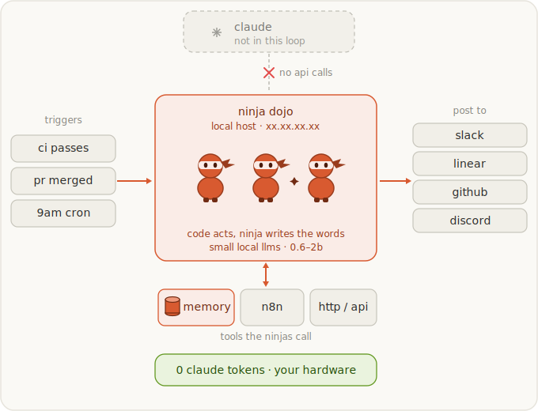

<p align="right"><a href="README.md">日本語</a> · <b>English</b></p>

# mcp-llm-offload

> An MCP server that offloads **light LLM work** from Claude (or any MCP client) to a model you control — a **local** LLM (LM Studio, Ollama, llama.cpp) or **any OpenAI-compatible provider** (OpenRouter, xAI Grok, OpenAI, Groq, Together…). Save frontier-model quota on the cheap, non-critical stuff.

[](https://github.com/jonpol01/mcp-llm-offload/actions/workflows/ci.yml)
[](LICENSE)
[](https://www.python.org/)
[](https://modelcontextprotocol.io)
[](https://github.com/astral-sh/ruff)
[](#contributing)

<p align="center">
  
</p>

## Why

Frontier models are great, but a lot of day-to-day agent work is *light*: summarize this log, classify this ticket, pull fields out of this blob, rephrase this sentence. Paying frontier-model rates (and quota) for that is wasteful.

`mcp-llm-offload` exposes a handful of MCP tools that forward those tasks to a backend of **your** choosing. Because LM Studio, Ollama, llama.cpp, OpenRouter, Grok, OpenAI, Groq and Together all speak the same `/v1/chat/completions` API, one tiny server talks to all of them — and you can switch backends with an env var or override **per call**.

## Features

- 🔀 **Provider-agnostic** — one server, any OpenAI-compatible endpoint. Presets for the common ones; bring-your-own for the rest.
- 🏠 **Local-first** — defaults to a local LM Studio; no API key required for local backends.
- 🎯 **Purpose-built tools** — `ask`, `summarize`, `classify`, `extract`, `health` — each shaped for a light task, not just a raw chat passthrough.
- 🧭 **Per-call routing** — every tool takes optional `provider` and `model` args, so the cheap stuff goes local and the *slightly* harder stuff can go to Grok/OpenRouter without reconfiguring.
- 🩺 **Actionable errors** — connection, timeout, auth, 404-model, and rate-limit failures come back as plain, fix-this-next strings instead of stack traces.
- 📦 **Single file, zero install** — [PEP 723](https://peps.python.org/pep-0723/) inline deps mean `uv run llm_offload_mcp.py` just works.
- 🤖 **Claude Code subagent included** — an optional `llm-offloader` agent that auto-routes light work for you.

## Recommended local models

Light offload work doesn't need a big model. A small `0.6b`–`2b` class instruction model is plenty for summaries, classification, and short rewrites. Good defaults:

| Model | When |
|-------|------|
| `gemma-4-e2b-it` | **Default pick.** Fastest; great for classify / summarize / short asks. |
| `gemma-4-e4b-it` | A bit smarter for slightly harder rephrasing or messier input, still cheap. |

On Apple Silicon, prefer the MLX builds in LM Studio (e.g. `gemma-4-e2b-it-mlx`). Qwen, Llama, and Phi models in the same size class work just as well — set whichever id your backend serves via `LLM_MODEL`.

## Supported providers

| Provider     | Default endpoint                         | API key env           | Example model |
|--------------|------------------------------------------|-----------------------|---------------|
| `lmstudio`   | `http://localhost:1234/v1`               | — (none)              | `gemma-4-e2b-it` |
| `ollama`     | `http://localhost:11434/v1`              | — (none)              | `llama3.1` |
| `llamacpp`   | `http://localhost:8080/v1`               | — (none)              | *loaded model* |
| `openrouter` | `https://openrouter.ai/api/v1`           | `OPENROUTER_API_KEY`  | `meta-llama/llama-3.3-70b-instruct` |
| `grok`       | `https://api.x.ai/v1`                     | `XAI_API_KEY`         | `grok-2-latest` |
| `openai`     | `https://api.openai.com/v1`              | `OPENAI_API_KEY`      | `gpt-4o-mini` |
| `groq`       | `https://api.groq.com/openai/v1`         | `GROQ_API_KEY`        | `llama-3.1-8b-instant` |
| `together`   | `https://api.together.xyz/v1`            | `TOGETHER_API_KEY`    | `meta-llama/Llama-3.3-70B-Instruct-Turbo` |
| `deepinfra`  | `https://api.deepinfra.com/v1/openai`    | `DEEPINFRA_API_KEY`   | *see DeepInfra* |
| `mistral`    | `https://api.mistral.ai/v1`              | `MISTRAL_API_KEY`     | `mistral-small-latest` |
| *anything else* | set `<NAME>_BASE_URL`                  | `<NAME>_API_KEY`      | *— any OpenAI-compatible service* |

> Use any name you like for a custom provider: set `FOO_BASE_URL` (and `FOO_API_KEY` if needed), then call a tool with `provider="foo"`.

## How it works

```
Claude Code ──stdio──▶ mcp-llm-offload ──HTTP /v1/chat/completions──▶ your backend
   (frontier)            (this server)                                 (local / Grok / OpenRouter …)
```

The server is a thin, well-behaved MCP front-end. It resolves *which* backend and model to use (per call → env → preset), folds any system instruction into the user turn for maximum template compatibility, calls the endpoint, and returns clean text (or an `Error: …` string).

The diagram above shows the bigger picture this enables: small local models acting as autonomous "ninjas" that handle routine chores end-to-end, so Claude is never invoked for them.

## Quick start

### 1. Prerequisites

- [`uv`](https://docs.astral.sh/uv/) (recommended) — or Python 3.10+ with `pip`.
- A backend: a running local server (e.g. [LM Studio](https://lmstudio.ai/) → **Developer ▸ Start Server**) **or** an API key for a hosted provider.

### 2. Get it

```bash
git clone https://github.com/jonpol01/mcp-llm-offload.git
cd mcp-llm-offload
```

Run it standalone to confirm it starts (it serves MCP over stdio, so it will wait for a client — `Ctrl-C` to exit):

```bash
uv run llm_offload_mcp.py
```

> No `uv`? `pip install mcp httpx` then `python llm_offload_mcp.py`.

### 3. Register with Claude Code

The MCP **server name you choose here becomes the tool prefix** (`mcp__<name>__ask`, …). The bundled subagent expects the name **`offload`**, so use that unless you also edit the agent.

**Local LM Studio** (point it at a LAN host if LM Studio runs on another machine):

```bash
claude mcp add offload \
  -e LLM_PROVIDER=lmstudio \
  -e LMSTUDIO_BASE_URL=http://localhost:1234/v1 \
  -e LLM_MODEL=gemma-4-e2b-it \
  -- uv run /absolute/path/to/llm_offload_mcp.py
```

**OpenRouter:**

```bash
claude mcp add offload \
  -e LLM_PROVIDER=openrouter \
  -e OPENROUTER_API_KEY=sk-or-... \
  -e LLM_MODEL=meta-llama/llama-3.3-70b-instruct \
  -- uv run /absolute/path/to/llm_offload_mcp.py
```

**xAI Grok:**

```bash
claude mcp add offload \
  -e LLM_PROVIDER=grok \
  -e XAI_API_KEY=xai-... \
  -e LLM_MODEL=grok-2-latest \
  -- uv run /absolute/path/to/llm_offload_mcp.py
```

Or, equivalently, in a JSON MCP config (`.mcp.json`, Claude Desktop, etc.):

```json
{
  "mcpServers": {
    "offload": {
      "command": "uv",
      "args": ["run", "/absolute/path/to/llm_offload_mcp.py"],
      "env": {
        "LLM_PROVIDER": "lmstudio",
        "LMSTUDIO_BASE_URL": "http://localhost:1234/v1",
        "LLM_MODEL": "gemma-4-e2b-it"
      }
    }
  }
}
```

### 4. Verify

In Claude Code, run the `health` tool (or ask Claude to). You should see the resolved provider, base URL, and the list of models the backend reports.

## Tools

| Tool | Signature | Purpose |
|------|-----------|---------|
| `ask` | `ask(prompt, system?, provider?, model?, temperature?, max_tokens?)` | Free-form light generation (Q&A, rephrase, draft). |
| `summarize` | `summarize(text, max_words?, style?, provider?, model?)` | Faithful summary, length- and style-bounded. |
| `classify` | `classify(text, labels[], provider?, model?)` | Single-label classification; returns one of `labels`. |
| `extract` | `extract(text, instructions, provider?, model?)` | Structured extraction → clean JSON string. |
| `health` | `health(provider?)` | Reachability check + lists the backend's models. |

Every generation tool accepts `provider` and `model` to override the configured default for that single call.

## Configuration

All configuration is via environment variables — none are required if the defaults (a local LM Studio) suit you and you pass `model` per call.

| Variable | Description | Default |
|----------|-------------|---------|
| `LLM_PROVIDER` | Default provider name (see table). | `lmstudio` |
| `LLM_MODEL` | Default model id (as the provider names it). | *(unset)* |
| `LLM_TIMEOUT` | Request timeout, seconds. | `300` |
| `<PROVIDER>_BASE_URL` | Override a provider's endpoint, e.g. `LMSTUDIO_BASE_URL`. | preset |
| `<PROVIDER>_API_KEY` | A provider's API key, e.g. `OPENROUTER_API_KEY`. | conventional env / `LLM_API_KEY` |
| `<PROVIDER>_MODEL` | Default model for a specific provider. | `LLM_MODEL` |
| `LLM_BASE_URL` / `LLM_API_KEY` | Generic fallbacks for the default provider. | — |
| `OPENROUTER_REFERER` / `OPENROUTER_TITLE` | Optional OpenRouter ranking headers. | — |

See [`.env.example`](.env.example) for a copy-paste starting point.

## The Claude Code subagent (optional)

[`agents/llm-offloader.md`](agents/llm-offloader.md) is a ready-made subagent that proactively routes light work to this server and hands anything heavy or correctness-critical back to the main agent. It runs on a cheap dispatch model (`haiku`) so the *routing* costs almost nothing and the *work* lands on your backend.

```bash
# user-wide
cp agents/llm-offloader.md ~/.claude/agents/
# or per-project
mkdir -p .claude/agents && cp agents/llm-offloader.md .claude/agents/
```

> Its `tools:` list references `mcp__offload__*`, so it requires the server to be registered under the name **`offload`**.

## Troubleshooting

| Symptom | Likely fix |
|---------|------------|
| `could not reach the endpoint` | Backend isn't running / wrong URL. For LM Studio, **Start Server** and bind to `0.0.0.0` for LAN access; set `LMSTUDIO_BASE_URL`. |
| `401/403 authentication failure` | Missing/invalid API key — set the provider's `*_API_KEY`. |
| `404 … Model '…' may not exist` | Model id is wrong or not loaded. Run `health` to list what the backend actually serves. |
| `429 rate-limited` | Back off, or pass `provider=` to route this call elsewhere. |
| `timed out` | Large input or a slow/loading model — raise `LLM_TIMEOUT`. |
| Subagent has no tools | Server isn't registered under the name `offload` (or not registered at all). |

## Development

```bash
uvx ruff check .          # lint
uv run --with mcp --with httpx python -c \
  "import importlib.util as u; s=u.spec_from_file_location('m','llm_offload_mcp.py'); m=u.module_from_spec(s); s.loader.exec_module(m); print('ok', m.mcp.name)"
```

CI (GitHub Actions) runs the same lint + import smoke test on every push and PR.

## Contributing

Issues and PRs welcome. Keep the server single-file and provider-neutral; new providers are usually just one row in the `PROVIDERS` registry.

## License

[MIT](LICENSE) © John Paul Soliva
