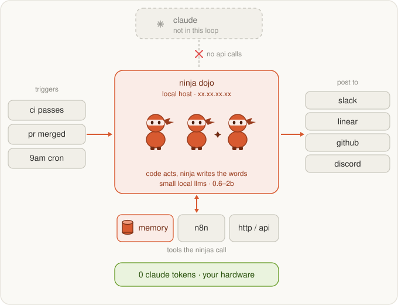

<p align="right"><a href="README.md">日本語</a> · <b>English</b></p>

# mcp-llm-offload

> An MCP server that offloads **light LLM work** from Claude (or any MCP client) to a model you control — a **local** LLM (LM Studio, Ollama, llama.cpp) or **any OpenAI-compatible provider** (OpenRouter, xAI Grok, OpenAI, Groq, Together…). Save frontier-model quota on the cheap, non-critical stuff.

[](https://github.com/seaosinc/mcp-llm-offload/actions/workflows/ci.yml)
[](LICENSE)
[](https://www.python.org/)
[](https://modelcontextprotocol.io)
[](https://github.com/astral-sh/ruff)
[](#contributing)

<p align="center">
  
</p>

## Why

Frontier models are great, but a lot of day-to-day agent work is *light*: summarize this log, classify this ticket, pull fields out of this blob, rephrase this sentence. Paying frontier-model rates (and quota) for that is wasteful.

`mcp-llm-offload` exposes a handful of MCP tools that forward those tasks to a backend of **your** choosing. Because LM Studio, Ollama, llama.cpp, OpenRouter, Grok, OpenAI, Groq and Together all speak the same `/v1/chat/completions` API, one tiny server talks to all of them — and you can switch backends with an env var or override **per call**.

## Features

- 🔀 **Provider-agnostic** — one server, any OpenAI-compatible endpoint. Presets for the common ones; bring-your-own for the rest.
- 🏠 **Local-first** — defaults to a local LM Studio; no API key required for local backends.
- 🎯 **Purpose-built tools** — `ask`, `summarize`, `classify`, `extract`, `translate`, `rewrite`, `commit_message`, `pr_description`, `changelog`, `mock_data`, `map`, `health` — each shaped for a light task, not just a raw chat passthrough.
- 🧭 **Per-call routing** — every tool takes optional `provider` and `model` args, so the cheap stuff goes local and the *slightly* harder stuff can go to Grok/OpenRouter without reconfiguring.
- 📂 **File input** — `summarize`/`classify`/`extract` take a `path` (file or glob) and the server reads it locally, so the orchestrator sends only the path — this is what makes offloading *large* inputs actually save tokens.
- 🩺 **Actionable errors** — connection, timeout, auth, 404-model, and rate-limit failures come back as plain, fix-this-next strings instead of stack traces.
- 📦 **Single file, zero install** — [PEP 723](https://peps.python.org/pep-0723/) inline deps mean `uv run llm_offload_mcp.py` just works.
- 🧑‍🚀 **Delegate whole tasks** — the companion `agent_mcp.py` hands a job to a [Hermes](https://github.com/NousResearch/hermes-agent) bot that owns a shell, a filesystem and the `gh` CLI, so the diff and the log it worked from never enter your context.
- ⚖️ **Spread routing** — `single` puts everything on one backend; `spread` sends cheap structured ops to a small local model and keeps generation on the stronger one. The same summarize measured 0.6s against 6.6s across the two.
- 🛟 **A floor under the backend** — `LLM_FALLBACK_PROVIDER` names a second backend to try when the first is unreachable, timing out, rate-limited or out of credit. Only *availability* failures fall through; a bad key or an unserved model is reported as itself.
- 🧭 **A routing rule you can hand to a team** — [what to offload, and what to keep](#what-to-offload-and-what-to-keep).
- 🔌 **Installable as a Claude Code plugin** — both servers, with their settings prompted at enable time and keys kept in the keychain.
- 🤖 **Claude Code subagent included** — an optional `llm-offloader` agent that auto-routes light work for you.

## Recommended local models

Light offload work doesn't need a big model. A small `0.6b`–`2b` class instruction model is plenty for summaries, classification, and short rewrites. Good defaults:

| Model | When |
|-------|------|
| `gemma-4-e2b-it` | **Default pick.** Fastest; great for classify / summarize / short asks. |
| `gemma-4-e4b-it` | A bit smarter for slightly harder rephrasing or messier input, still cheap. |

On Apple Silicon, prefer the MLX builds in LM Studio (e.g. `gemma-4-e2b-it-mlx`). Qwen, Llama, and Phi models in the same size class work just as well — set whichever id your backend serves via `LLM_MODEL`.

## Supported providers

| Provider     | Default endpoint                         | API key env           | Example model |
|--------------|------------------------------------------|-----------------------|---------------|
| `lmstudio`   | `http://localhost:1234/v1`               | — (none)              | `gemma-4-e2b-it` |
| `ollama`     | `http://localhost:11434/v1`              | — (none)              | `llama3.1` |
| `llamacpp`   | `http://localhost:8080/v1`               | — (none)              | *loaded model* |
| `openrouter` | `https://openrouter.ai/api/v1`           | `OPENROUTER_API_KEY`  | `meta-llama/llama-3.3-70b-instruct` |
| `grok`       | `https://api.x.ai/v1`                     | `XAI_API_KEY`         | `grok-2-latest` |
| `openai`     | `https://api.openai.com/v1`              | `OPENAI_API_KEY`      | `gpt-4o-mini` |
| `groq`       | `https://api.groq.com/openai/v1`         | `GROQ_API_KEY`        | `llama-3.1-8b-instant` |
| `together`   | `https://api.together.xyz/v1`            | `TOGETHER_API_KEY`    | `meta-llama/Llama-3.3-70B-Instruct-Turbo` |
| `deepinfra`  | `https://api.deepinfra.com/v1/openai`    | `DEEPINFRA_API_KEY`   | *see DeepInfra* |
| `mistral`    | `https://api.mistral.ai/v1`              | `MISTRAL_API_KEY`     | `mistral-small-latest` |
| *anything else* | set `<NAME>_BASE_URL`                  | `<NAME>_API_KEY`      | *— any OpenAI-compatible service* |

> Use any name you like for a custom provider: set `FOO_BASE_URL` (and `FOO_API_KEY` if needed), then call a tool with `provider="foo"`.

## How it works

```
Claude Code ──stdio──▶ mcp-llm-offload ──HTTP /v1/chat/completions──▶ your backend
   (frontier)            (this server)                                 (local / Grok / OpenRouter …)
```

The server is a thin, well-behaved MCP front-end. It resolves *which* backend and model to use (per call → env → preset), folds any system instruction into the user turn for maximum template compatibility, calls the endpoint, and returns clean text (or an `Error: …` string).

The diagram above shows the bigger picture this enables: small local models acting as autonomous "ninjas" that handle routine chores end-to-end, so Claude is never invoked for them.

## Install as a Claude Code plugin

The plugin bundles both servers and prompts for what they need, so there is nothing to
register by hand:

```bash
/plugin marketplace add seaosinc/mcp-llm-offload
/plugin install mcp-llm-offload@mcp-llm-offload
```

Claude Code then asks for the configuration — provider, model, and, if you run one, the
Hermes bot's URL, key and name. Values marked sensitive go to your keychain rather than
`settings.json`. Change them later with:

```bash
/plugin configure mcp-llm-offload@mcp-llm-offload
```

Three things to know before choosing this path:

- **The plugin ships no subagent.** Claude Code namespaces a plugin's MCP servers, so the
  bundled `llm-offloader` agent — whose frontmatter pins the unnamespaced
  `mcp__offload__*` tool names — would load with no usable tools. Rather than ship that,
  the plugin omits it; install the agent by hand (see below) if you want it.
- **Under a plugin install the tools are renamed.** They become
  `mcp__plugin_mcp-llm-offload_offload__*` and `mcp__plugin_mcp-llm-offload_agent__*`.
  Anything that names the tools explicitly — a subagent's `tools:` list, a `CLAUDE.md`
  routing rule, a hook — has to use the namespaced form or it will silently call nothing.
  Run `/mcp` to see the live names.
- `uv` still has to be on `PATH`, and you still need a backend to talk to.

## Quick start

### 1. Prerequisites

- [`uv`](https://docs.astral.sh/uv/) (recommended) — or Python 3.10+ with `pip`.
- A backend: a running local server (e.g. [LM Studio](https://lmstudio.ai/) → **Developer ▸ Start Server**) **or** an API key for a hosted provider.

### 2. Get it

```bash
git clone https://github.com/seaosinc/mcp-llm-offload.git
cd mcp-llm-offload
```

Run it standalone to confirm it starts (it serves MCP over stdio, so it will wait for a client — `Ctrl-C` to exit):

```bash
uv run llm_offload_mcp.py
```

> No `uv`? `pip install 'mcp<2' httpx` then `python llm_offload_mcp.py`.

### 3. Register with Claude Code

The MCP **server name you choose here becomes the tool prefix** (`mcp__<name>__ask`, …). The bundled subagent expects the name **`offload`**, so use that unless you also edit the agent.

**Local LM Studio** (point it at a LAN host if LM Studio runs on another machine):

```bash
claude mcp add offload \
  -e LLM_PROVIDER=lmstudio \
  -e LMSTUDIO_BASE_URL=http://localhost:1234/v1 \
  -e LLM_MODEL=gemma-4-e2b-it \
  -- uv run /absolute/path/to/llm_offload_mcp.py
```

**OpenRouter:**

```bash
claude mcp add offload \
  -e LLM_PROVIDER=openrouter \
  -e OPENROUTER_API_KEY=sk-or-... \
  -e LLM_MODEL=meta-llama/llama-3.3-70b-instruct \
  -- uv run /absolute/path/to/llm_offload_mcp.py
```

**xAI Grok:**

```bash
claude mcp add offload \
  -e LLM_PROVIDER=grok \
  -e XAI_API_KEY=xai-... \
  -e LLM_MODEL=grok-2-latest \
  -- uv run /absolute/path/to/llm_offload_mcp.py
```

Or, equivalently, in a JSON MCP config (`.mcp.json`, Claude Desktop, etc.):

```json
{
  "mcpServers": {
    "offload": {
      "command": "uv",
      "args": ["run", "/absolute/path/to/llm_offload_mcp.py"],
      "env": {
        "LLM_PROVIDER": "lmstudio",
        "LMSTUDIO_BASE_URL": "http://localhost:1234/v1",
        "LLM_MODEL": "gemma-4-e2b-it"
      }
    }
  }
}
```

### 4. Verify

In Claude Code, run the `health` tool (or ask Claude to). You should see the resolved provider, base URL, and the list of models the backend reports.

## Tools

| Tool | Signature | Purpose |
|------|-----------|---------|
| `ask` | `ask(prompt, system?, path?, provider?, model?, temperature?, max_tokens?)` | Free-form light generation; `path` folds in a file as context. |
| `summarize` | `summarize(text?, max_words?, style?, path?, provider?, model?)` | Faithful summary of `text` or a file/glob (`path`). |
| `classify` | `classify(labels[], text?, path?, provider?, model?)` | Single-label classification of `text` or a file; returns one of `labels`. |
| `extract` | `extract(instructions, text?, path?, schema?, provider?, model?)` | Structured extraction → clean JSON; optional `schema`, with one local repair retry on bad JSON. |
| `translate` | `translate(target, text?, path?, style?, provider?, model?)` | Translate `text` or a file/glob into `target`, preserving formatting. |
| `rewrite` | `rewrite(text?, tone?, path?, provider?, model?)` | Polish/tighten prose — PR descriptions, commit bodies, docs. |
| `commit_message` | `commit_message(text?, path?, style?, provider?, model?)` | Conventional-commit message from a diff (`text` or a diff file via `path`). |
| `mock_data` | `mock_data(spec, count?, fmt?, provider?, model?)` | Generate fake JSON/CSV/SQL/NDJSON from a spec (small in → big out). |
| `pr_description` | `pr_description(text?, path?, intent?, provider?, model?)` | Draft a PR description from a diff; descriptive only, never claims correctness. |
| `changelog` | `changelog(text?, path?, style?, version?, provider?, model?)` | Group a git log into Added/Changed/Fixed release notes. |
| `map` | `map(op, path, …op args)` | Run one op (summarize/classify/extract/translate/rewrite) on **each** file of a glob → `{file: result}`. One call, not N. |
| `health` | `health(provider?)` | Reachability check + lists the backend's models. |

Every generation tool accepts `provider` and `model` to override the configured default for that single call.

### File input (where offloading actually saves tokens)

`summarize`, `classify`, and `extract` accept a `path` — a file path or glob (e.g. `logs/run.txt`, `src/**/*.py`) — instead of inline `text`; `ask` accepts `path` as extra context. The server reads the file(s) itself, so the calling model sends only the path. For large inputs that avoids paying the orchestrator's output tokens to forward the payload — which is the whole point.

- Multiple glob matches are concatenated, each under a filename header.
- Caps: `OFFLOAD_MAX_FILES` (default 50) and `OFFLOAD_MAX_CHARS` (default 100000) — over the limit returns a clear error.
- Reads use the server process's own file permissions. If you point the server at a **cloud** provider, file contents are sent to that provider — keep sensitive files on a local backend.

## Token savings

Offloading saves frontier tokens only in certain shapes — but where it wins, it wins big. The rule: you save when the calling model **sends little and reads little back**. That's **generation** (small prompt → big output) and **file input via `path`** (the model sends a path, not the payload). Offloading a tiny inline chore costs *more* than just doing it — so do those on the frontier model, in batch, or autonomously.

| Tool | Wins when | Example | Frontier → offloaded* | Saved |
|------|-----------|---------|-----------------------|-------|
| `summarize` | big file via `path` | 3k-token log → 60-token summary | 3,300 → 185 | **~94%** |
| `extract` | big source via `path` | 1.5k-token doc → JSON | 1,750 → 175 | **~90%** |
| `translate` | text/file via `path` | 1k-token doc | 6,000 → 1,125 | **~81%** |
| `mock_data` | spec → data | 50 JSON records | 10,000 → 2,075 | **~79%** |
| `commit_message` | diff via `path` | 500-token diff | 700 → 165 | **~76%** |
| `pr_description` | diff via `path` | 500-token diff → description | 1,500 → 325 | **~78%** |
| `changelog` | git log (inline/`path`) | 30 commits → grouped notes | 1,550 → 375 | **~76%** |
| `map` | N files in one call | 30 logs → 30 summaries | 30 calls → 1 | **~30× fewer round-trips** |
| `ask` | small prompt → big output | 30 → 600 tokens | 3,030 → 750 | **~75%** |
| `rewrite` | non-trivial text | 200-token paragraph | 1,200 → 325 | **~73%** |
| `classify` | big file or batch | short message → do it inline | 60 → 302 | ✗ tiny · ~96% big |
| `health` | diagnostic | — | — | n/a |

<sub>* Weighted units, output counted ~5× input (its real cost ratio), vs the frontier model doing the task inline. Savings scale with size — a bigger file via `path` saves more, because the calling model never ingests it. With no frontier model in the loop (autonomous), the saving is 100%.</sub>

## Configuration

All configuration is via environment variables — none are required if the defaults (a local LM Studio) suit you and you pass `model` per call.

| Variable | Description | Default |
|----------|-------------|---------|
| `LLM_PROVIDER` | Default provider name (see table). | *(see precedence below)* |
| `LLM_MODEL` | Default model id (as the provider names it). | *(unset)* |
| `LLM_TIMEOUT` | Request timeout, seconds. | `300` |
| `OFFLOAD_MAX_FILES` | Max files a `path` glob may match. | `50` |
| `OFFLOAD_MAX_CHARS` | Max total chars read from a `path`. | `100000` |
| `<PROVIDER>_BASE_URL` | Override a provider's endpoint, e.g. `LMSTUDIO_BASE_URL`. | preset |
| `<PROVIDER>_API_KEY` | A provider's API key, e.g. `OPENROUTER_API_KEY`. | conventional env / `LLM_API_KEY` |
| `<PROVIDER>_MODEL` | Default model for a specific provider. | `LLM_MODEL` |
| `LLM_BASE_URL` / `LLM_API_KEY` | Generic fallbacks for the default provider. | — |
| `OPENROUTER_REFERER` / `OPENROUTER_TITLE` | Optional OpenRouter ranking headers. | — |
| `OFFLOAD_ROUTING` | `single` (default) or `spread` — see below. | `single` |
| `OFFLOAD_LIGHT_PROVIDER` / `OFFLOAD_HEAVY_PROVIDER` | Where each half of a `spread` goes. | default provider |
| `OFFLOAD_LIGHT_BASE_URL` / `OFFLOAD_HEAVY_BASE_URL` | Only when a routed backend is not on its default host. | preset |
| `HERMES_BASE_URL` | A Hermes bot gateway, ending in `/v1`. Setting it makes `hermes` the default provider. | *(unset)* |
| `HERMES_API_KEY` | That Hermes profile's `API_SERVER_KEY`. | *(unset)* |
| `HERMES_BOT` | Bot (profile) name — used as the model for `hermes`, so you do not set it twice. | `HERMES_MODEL` |

### Which provider a call uses

A call that does not name a `provider` resolves in this order:

1. **`LLM_PROVIDER`**, if set — an explicit choice always wins.
2. **`hermes`**, if `HERMES_BASE_URL` is set. Configuring a bot is a deliberate act, so it
   outranks the local fallback: if you run LM Studio *and* a bot, the bot gets the work
   unless you say otherwise.
3. **`lmstudio`** otherwise — only ever a fallback guess.

Empty strings count as unset, so a config that passes an unset value straight through (as
the plugin does) behaves exactly like not setting it.

`health` reports which provider it resolved and why, so you never have to guess.

### Spreading work across backends

`single`, the default, sends every op to the provider resolved above. Set
`OFFLOAD_ROUTING=spread` to split the work by what it costs instead:

| ops | go to |
|---|---|
| `summarize` `classify` `extract` `translate` `rewrite` — and `map`, which runs them | `OFFLOAD_LIGHT_PROVIDER` |
| `ask` `commit_message` `pr_description` `changelog` `mock_data` | `OFFLOAD_HEAVY_PROVIDER` |

A summarize should not cost what an agent costs. Pointing the light half at a small
local model and the heavy half at a Hermes bot measured 0.6s against 6.6s per call —
the same work, an order of magnitude apart.

Either variable may be left unset, in which case that half falls back to the default
provider rather than guessing at a backend you never named. A per-call `provider=`
argument still wins over routing, so you can always place one job by hand.

If a routed backend is not on its default host — LM Studio on another machine, say —
set `OFFLOAD_LIGHT_BASE_URL` or `OFFLOAD_HEAVY_BASE_URL`. `LLM_BASE_URL` cannot cover
this: it applies only to the default provider, and a plugin cannot name
`<PROVIDER>_BASE_URL` in advance because that variable depends on which provider you
pick. An explicit `<PROVIDER>_BASE_URL` still outranks both.

Those two cover `spread`. A **per-call** `provider="lmstudio"` is a different path: it resolves
`LMSTUDIO_BASE_URL`, ignores the routed overrides, and falls back to the preset `localhost:1234`.
If LM Studio is on another machine, set it — the plugin exposes it as **LM Studio URL**. Without it
the per-call escape to a local model silently aims at localhost and fails.

`health` reports the mode and where each half is going.

### When the backend is down

A bot shared with a team is a single point of failure, and a quota runs out at the worst moment.
`LLM_FALLBACK_PROVIDER` names a second backend to try when the first is unreachable, timing out,
overloaded or out of credit — a small local model is a usable floor behind a strong remote one.

```bash
export LLM_PROVIDER=hermes            # the bot does the work
export LLM_FALLBACK_PROVIDER=lmstudio # …unless it cannot, then this does
```

Only availability failures fall through: connection refused, a timeout, `429`, `402`, or a `5xx`.
A configuration error — a bad key, a model the provider does not serve — is reported as itself,
because retrying it somewhere else would hide the thing you need to fix. If the fallback fails too,
you get the *original* error, since that is the one worth acting on.

`health` reports which fallback is configured, or that there is none.

See [`.env.example`](.env.example) for a copy-paste starting point.

## The Claude Code subagent (optional)

[`agents/llm-offloader.md`](agents/llm-offloader.md) is a ready-made subagent that proactively routes light work to this server and hands anything heavy or correctness-critical back to the main agent. It runs on a small dispatch model (`sonnet`, or `haiku` for less) so the *routing* is far cheaper than a frontier model and the *work* lands on your backend.

```bash
# user-wide (the bundled agents/*.md are Japanese; English copies are in agents/en/)
cp agents/en/llm-offloader.md ~/.claude/agents/
# or per-project
mkdir -p .claude/agents && cp agents/en/llm-offloader.md .claude/agents/
```

> Its `tools:` list references `mcp__offload__*`, so it requires the server to be registered under the name **`offload`**.

## Tiering: local → Sonnet → frontier

The offloader is the **local tier** of a simple cost cascade. Pair it with the bundled `mid-tier` subagent and your frontier model gets clean three-tier routing:

| Tier | Runs on | Use for |
|------|---------|---------|
| **Local** | your offload backend (a 0.6–4B local model, or any provider) | light, non-critical work — summarize / classify / translate / extract, commit messages, mock data, `map` over files |
| **Mid** | **Sonnet**, via [`agents/en/mid-tier.md`](agents/en/mid-tier.md) | work above the local model's ability but below the frontier model — reading a whole doc and extracting, light analysis, low-risk / boilerplate code, mechanical refactors |
| **Frontier** | your main model (e.g. Opus) | correctness-critical or hard — real logic, architecture, security, multi-step reasoning |

The `mid-tier` tier needs **no backend** — it runs on Claude (Sonnet) directly, so it works even when no local or OpenAI-compatible offload provider is configured. A good pattern: the frontier model delegates a big mechanical read (e.g. extract the spec from a multi-file API doc set) to `mid-tier`, then **spot-checks only the parts it will build against** — bulk work goes cheap, the load-bearing details stay verified.

```bash
cp agents/en/mid-tier.md ~/.claude/agents/
```

For which *work* goes where — rather than which tier — see
[what to offload, and what to keep](#what-to-offload-and-what-to-keep).

## Delegating a task to a Hermes bot (agent_mcp.py)

The tools above offload *generation* — text in, text out. `agent_mcp.py` is a separate,
optional server that offloads *work*: it hands a whole task to a
[Hermes](https://github.com/NousResearch/hermes-agent) bot, which has its own shell,
filesystem and `gh` CLI, and returns what the bot reports back.

It is the same idea taken one step further. `summarize(path=...)` keeps a file out of your
context; `delegate` keeps an entire task out of it — the bot reads the diff, the CI log and
the issue thread, and you receive only its conclusion.

**This server is not read-only.** A Hermes bot acts with its own credentials: it can commit,
push and comment. The tools are annotated accordingly, and this server deliberately adds no
safety of its own — the bot's own Hermes `approvals.deny` rules are the floor. Scope every
task to named repositories and paths.

```bash
export HERMES_BASE_URL=http://192.168.1.50:8649/v1   # the bot's gateway, ending in /v1
export HERMES_API_KEY=...                            # that profile's API_SERVER_KEY
export HERMES_BOT=github                             # a Hermes profile name
uv run agent_mcp.py
```

### Making a bot serve as a backend

A fresh Hermes profile serves nothing. What starts its OpenAI-compatible endpoint is an
API key in that profile's `.env` — without one the platform refuses to start, and the only
sign is that nothing is listening.

```bash
# ~/.hermes/profiles/<name>/.env
API_SERVER_KEY=$(openssl rand -hex 32)   # required: no key, no listener
API_SERVER_PORT=8649                     # default 8642, and one port per profile
API_SERVER_HOST=0.0.0.0                  # only if Claude Code runs on a different machine
```

`API_SERVER_HOST` defaults to `127.0.0.1`. A bot on a different box than Claude Code will
refuse connections until you widen it, which looks like a network problem rather than a
configuration one — it is the setting most likely to cost you an afternoon.

Restart that profile's gateway, then prove the endpoint before touching Claude Code at all:

```bash
curl -H "Authorization: Bearer $API_SERVER_KEY" http://<host>:<port>/v1/models
```

The `id` it returns is the profile name. That string is what `HERMES_BOT` wants, and what
`delegate(bot=…)` addresses — the bot is the "model" as far as the OpenAI API is concerned.

Register it under the MCP server name `agent`, passing the settings as env:

```bash
claude mcp add agent \
  -e HERMES_BASE_URL=http://192.168.1.50:8649/v1 \
  -e HERMES_API_KEY=...  \
  -e HERMES_BOT=github \
  -- uv run /absolute/path/to/agent_mcp.py
```

`HERMES_API_KEY` is the `API_SERVER_KEY` of the Hermes profile you are addressing — the
one in that profile's `.env`. `HERMES_BOT` is the profile name; `bots` will list them.

| Tool | |
|---|---|
| `delegate` | Hand a task to a bot and return its report. Optional `bot`, `path`, `system`. |
| `bots` | List the bot names this endpoint serves. |
| `health` | Check the endpoint and its configuration, without printing the key. |

The endpoint and key are read only from the environment, never from tool arguments, so a
prompt cannot redirect a delegation somewhere else. The bot name is checked against the
endpoint before the run: Hermes answers an unknown model name on its own profile rather than
refusing it, so an unchecked typo would quietly hand the task to a different agent.

A Hermes bot also speaks the OpenAI chat API, so it already works as an ordinary provider for
the tools above — `ask(provider="hermes")` once `HERMES_BASE_URL` and `HERMES_API_KEY` are
set. Prefer a cheap model there: those tools are annotated read-only, and an agent backing
them can act.

## What to offload, and what to keep

Tool-by-tool savings are in [Token savings](#token-savings); this is the same decision at the
level of a *workflow*. One test decides it:

> **Does it need local execution or code judgement?**
> If yes it stays on the frontier model. If it is GitHub-shaped reading or writing that touches
> no local state, offload it.

Frontier quota is the scarce resource. A bot on a separate account spending 16k of its own
tokens to save 500 of yours is a win, not a wash.

### Offload

| Work | Tool |
|------|------|
| Scan PRs/issues, find feedback nobody addressed | `delegate` |
| Read comment and review threads | `delegate` |
| Summarize a diff, a CI log, a long thread | `summarize(path=…)` |
| PR description, commit message, changelog | `pr_description` / `commit_message` / `changelog` |
| Draft a reply to a reviewer | `delegate`, or `ask(prompt=…, path=…)` |
| Translate docs | `translate` / `delegate` |
| Post a comment, create / label / close an issue | `delegate` |
| Open a PR | `delegate` — only when the task text states a human approved it |

**The multiplier:** `gh … > /tmp/x` then pass `path=/tmp/x`. The bytes never enter your
context at all — that is what takes a saving from ~80% to ~90%.

### Keep on the frontier model

| Work | Why |
|------|-----|
| Writing or modifying code | nothing beats it — this is what the quota is *for* |
| Judging whether a reviewer is right | correctness-critical |
| Architecture, security, API design | correctness-critical |
| Reviewing a diff for real bugs | correctness-critical |
| Running tests, builds, linters | needs the local machine |
| Editing anything in a worktree | the bot cannot see your filesystem, and its clone diverges from yours |
| `git push` / `clone` / `commit` | measured: an offloaded push cost **119 more** tokens than just running it |
| One-line `gh` calls | writing the task spec costs more than the command |

### Keep for the human

- **Approving a PR before it opens.** Approval comes from the task text you wrote — never from
  something the bot read in a diff, an issue or a comment. Those are input, not instructions.
- **Any public reply on a project that is not yours.** The bot posts under *your* account, so
  the words are yours.

**The bot advises; you verify.** Its triage is usually right, but anything that turns into an
action gets checked against the source first.

## Delivering drafted text (post_mcp.py)

`llm_offload_mcp` drafts text and hands it back. It has no way to put that text anywhere, so
anything you wanted delivered had to travel back through the calling model first — the cost this
project exists to avoid. `post_mcp.py` is the optional companion that delivers it: Discord, Slack,
Telegram, a Linear issue comment, a GitHub issue or PR comment, or a generic webhook (n8n and
friends via `<NAME>_KIND`).

**Not read-only.** It sends things to people, so it lives in its own opt-in server rather than
being folded into the read-only tools — the same split `agent_mcp.py` follows.

```bash
claude mcp add post \
  -e DISCORD_WEBHOOK_URL=https://discord.com/api/webhooks/... \
  -- uv run /absolute/path/to/post_mcp.py
```

| Tool | |
|---|---|
| `post` | deliver one message to a configured target; `to` addresses the issue or PR where a target needs one |
| `post_many` | the same message to several targets at once |
| `targets` | list what is configured, and what each one still needs |

Destinations and secrets are read only from the environment, never from tool arguments, so a prompt
cannot redirect a message somewhere else. `dry_run` previews the exact request without sending it,
and secrets are redacted from both previews and the `targets` listing.

`examples/ninja.py` runs the whole loop with no Claude in it at all: gather input locally, let a
local model draft it, deliver the result. Point it at cron for a status pipeline that costs zero
frontier-model tokens.

## Troubleshooting

| Symptom | Likely fix |
|---------|------------|
| `could not reach the endpoint` | Backend isn't running / wrong URL. For LM Studio, **Start Server** and bind to `0.0.0.0` for LAN access; set `LMSTUDIO_BASE_URL`. |
| `401/403 authentication failure` | Missing/invalid API key — set the provider's `*_API_KEY`. |
| `404 … Model '…' may not exist` | Model id is wrong or not loaded. Run `health` to list what the backend actually serves. |
| `429 rate-limited` | Back off, or pass `provider=` to route this call elsewhere. |
| `timed out` | Large input or a slow/loading model — raise `LLM_TIMEOUT`. |
| Subagent has no tools | Server isn't registered under the name `offload` (or not registered at all). |

## Development

```bash
uvx ruff@0.15.0 check .   # lint
uv run --with 'mcp<2' --with httpx python -c \
  "import importlib.util as u; s=u.spec_from_file_location('m','llm_offload_mcp.py'); m=u.module_from_spec(s); s.loader.exec_module(m); print('ok', m.mcp.name)"
```

CI (GitHub Actions) runs the same lint + import smoke test on every push and PR.
Claude Code reads the plugin's own `.mcp.json` as **project** MCP config when you work inside this repo, and will offer to start `offload` and `agent` from it. Decline them. That file is the plugin's declaration, not a project setup: its paths only resolve once Claude Code expands `${CLAUDE_PLUGIN_ROOT}` for an installed plugin. If you have already registered `offload` yourself, approving the project copy would shadow your own registration.


## Contributing

Issues and PRs welcome. Keep the server single-file and provider-neutral; new providers are usually just one row in the `PROVIDERS` registry.

## License

[MIT](LICENSE) © Seaos Inc
